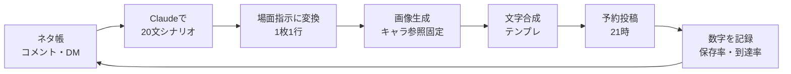

# ペット感動系アカウント 要件定義・チャンネル設計書（原本）

2026年9月25日 · @優太

> この文書は 2026-09-25 にチャットで共有された設計書の原本を、そのまま Markdown に起こしたもの。
> **実装で採用したルールは [decisions.md](decisions.md) が正。** ここと食い違う箇所は decisions.md を優先する。

## エグゼクティブサマリー

結論：「犬の十戒」の型（犬→飼い主への語りかけ）を、手描き風AIイラスト×20枚のTikTokフォトモードで毎日1本出すアカウントを作る。勝ち筋は「ありふれた日常の1シーン → 犬の本当の気持ち → いつか来る別れ → 今夜を大切に」という4幕構成を、毎回違う"あるある場面"で量産すること。

参考アカウント「ワン寿|shiba」は、実は犬用サプリ「ワン寿」の販売会社のアカウント群のひとつで、感動投稿は自社商品への集客装置になっている。つまりこのジャンルの本当の収益源はTikTokの再生報酬ではなく、信頼を貯めてから物販・アフィリエイトに流すこと。

優太さん向けの設計ポイント：
- 喋らない・顔出しなし・スマホ〜PCで完結（画像生成＋テンプレ配置）なので、既存の「手間をかけず続ける」方針とそのまま合う。
- 主役犬はマルくんと同じマルプーをモデルにした架空キャラにする。シュナウザー（参考）・柴（ワン寿）と被らず、国内人気の小型犬オーナー層に刺さる。
- フォトモード投稿はTikTokの再生報酬（Creator Rewards）の対象外。収益化は「フォロワー獲得→1分以上の動画版を別投稿」「アフィリエイト／自社商品」の二段構えで設計する。

最初の30日：アカウント開設 → キャラと画風を固定（プロンプト確定）→ 30本分のシナリオを先に作る → 毎日21〜23時に1本投稿 → 保存率とコメントで「刺さる場面」を特定。

## リサーチ①：参考アカウント「ワン寿|shiba」の構造分解

共有いただいた投稿は、20枚の写真カルーセルで「酔って床で寝た夜、犬がずっとそばにいた」という1夜を描いたもの。数字は いいね2,832・保存179・シェア61・コメント7。保存率は約6.3%（179÷2,832）で、コメントが極端に少ない＝「黙って泣いて保存する」タイプの投稿であることが分かる。

### 運営元とビジネスモデル
- 「ワン寿」は犬猫総合製薬株式会社が販売する小型犬用のふりかけ型サプリ（30本入り、2,980円前後）。
- 同社のTikTok（@dontadoyog7）はフォロワー約4.5万・いいね約220万で、プロフィールから長寿犬サプリとしてAmazonへ誘導している。
- 同社は「犬の気持ち」系の感動動画に #pr を付けて多数投稿しており、2分超の泣ける系動画で3万いいね超の実績もある。
- 「ワン寿|shiba」のように犬種名を付けたサブアカウントを複数持ち、同じ型を犬種違いで量産している可能性が高い（アカウント名からの推測）。

示唆：感動系は「フォロワーを増やす」より「飼い主の信頼を集めて、健康・長生きの商品に流す」ための入口として機能している。

### 20枚の物語構成（4幕）

| 幕 | 枚数 | 役割 | 参考投稿での中身（要約） |
|---|---|---|---|
| 1. 日常の失敗 | 1〜3枚 | 共感の入口。誰にでもある情けない夜 | 飲み会帰りにスーツのまま床で寝落ち。犬の水だけは替えた |
| 2. 気づき | 4〜8枚 | 犬の行動の"意味"に気づく | 夜中に目覚めると、犬が自分のベッドでなく隣の床で寝ていた |
| 3. 応答 | 9〜16枚 | 飼い主が行動で返す。犬がついてくる | 撫でる→着替える→寝室へ。短い足音がついてきて布団に飛び乗る |
| 4. 別れの予感と決意 | 17〜20枚 | 泣かせる核心。虹の橋→今を大切に | いつか来る別れまで、この愛情に応えようと抱き寄せて眠る |

### 再現すべき"型"のディテール
- 1枚＝1文（2行以内）。上に手書き風の文字、下に淡い色鉛筆風イラスト。背景はオフホワイトで余白が多い。
- 人物は顔を描かない／後ろ姿・手元・足元のみ。見る人が自分を重ねられる。
- 一人称は「私」、犬は名前を呼ばず「この子」「シュナウザー」。特定の家庭の話にしない。
- クライマックス1枚だけ文字色を赤にして強調。
- 首輪の色（赤）で犬の同一性を保つ。ただし絵柄はコマごとに若干ブレており、AI生成であることが推測できる。
- BGMはピアノの泣きBGM。投稿時刻は深夜帯（スクショは0時台）。
- ハッシュタグは #犬のいる暮らし #わんこのいる生活 など、飼い主のライフスタイル系。

### 改善の余地（差別化ポイント）
- キャラの顔・毛色が枚ごとに揺れる → キャラ固定の精度を上げるだけで一段上の見え方になる。
- 1枚目が文字だけで弱い → 1枚目に"答えの見えない問い"を置く（例：「夜中の2時、なぜこの子は床にいたのか」）。
- コメントが少ない → 最終枚に問いかけを置き、コメントを誘発する（「あなたの子が一番そばにいてくれた夜は？」）。

## リサーチ②：犬の十戒・10のお約束・虹の橋から学ぶ感動の型

ペットショップで渡される「10のお約束」系の冊子は、ほぼすべて「犬の十戒」がベースになっている。

### 原典について分かっていること
- 犬の十戒は作者不詳のまま広まった英文の短編詩で、ノルウェーのブリーダーが買い手に渡していた「犬からご主人への11のお願い」が元とされる。犬が人間に語りかける形式が特徴。
- 2008年公開の映画『犬と私の10の約束』のモチーフになった。
- 1項目目は「私の一生は10〜15年。あなたと離れるのはつらい。飼う前に覚えていて」という趣旨で、最初から"寿命"と"別れ"を提示する構造。
- 「虹の橋」も作者不詳の散文詩で、1980年代に米国で流布したものが日本に伝わったとされる。

### なぜ泣けるのか（感動のメカニズム）
1. **視点の反転**：普段は人間が犬を"世話している"つもりが、実は犬のほうが人間を見守っていた、と気づかされる。
2. **時間の非対称**：人の一生の中で犬の一生は10〜15年。犬にとって飼い主は"全部"だが、飼い主にとって犬は"一部"。この差が罪悪感と愛おしさを同時に生む。
3. **無言の献身**：犬は言葉で訴えない。だから行動（床で寝る、ついてくる、見上げる）に意味を与えると、見る側が自分の記憶で補完して泣く。
4. **別れの予告**：物語の終盤で「いつか」を1枚だけ入れる。直接的な死の描写はしない。
5. **決意で終わる**：悲しみで終わらせず「今夜を大切にしよう」で締める。見終わった後に愛犬を撫でたくなる＝行動につながる。

### 十戒の10テーマ → シリーズ企画への変換
原文をそのまま使うと"どこかで見た話"になり、原典の権利関係も曖昧なので、テーマだけ借りて、毎回オリジナルの日常シーンで描く。

| 十戒のテーマ（要旨） | 変換した日常シーン例 |
|---|---|
| 寿命は10〜15年 | 散歩道の桜を「あと何回一緒に見られるか」数える |
| 理解する時間をください | お迎え初日、トイレを失敗して震える子犬 |
| 信頼してほしい | 初めての留守番、玄関で待ち続ける |
| 長く怒らないで／閉じ込めないで | 叱った後、ケージの隅で背中を向ける |
| 話しかけて | 仕事の愚痴を聞いてくれる夜 |
| 扱われ方を忘れない | 保護犬が初めてしっぽを振った日 |
| 噛めるけど噛まない | 子どもに耳を引っ張られても我慢する |
| 元気がない時は理由がある | ごはんを残した日、実は体調のサインだった |
| 年を取っても世話をして | 階段を上れなくなった老犬を抱っこする |
| 最期はそばにいて | 動物病院の待合室で手を握る（直接描写はしない） |

## リサーチ③：市場とプラットフォーム

| 項目 | 事実 | 設計への影響 |
|---|---|---|
| 犬の飼育頭数（2025年） | 約682万頭で前年から微増。1年以内の新規飼育は約45.1万頭 | 毎年45万人前後の「新米飼い主」＝お迎え系シリーズの需要 |
| 飼育率が伸びる層 | 単身20〜30代、既婚子あり20〜30代で犬の飼育率が上昇 | TikTokの主要層と一致。ペルソナの軸にする |
| ペットフード出荷額 | 4,594億円で9年連続増 | 物販・健康商品の余地 |
| フォトモード | 画像を並べて投稿するだけで伸びた事例あり | 動画編集なしで勝負できる |
| 2026年のアルゴリズム | 視聴完了率・視聴時間、保存数、TikTok内検索、アカウントの専門性の比重が増したとされる | 20枚を最後までめくらせる構成、保存したくなる終わり方、犬ジャンル一本に絞る |
| 再生報酬（Creator Rewards） | 1分超のオリジナル動画が対象で、フォトモードは対象外。フォロワー1万人・30日で10万再生などが条件 | 同じ素材で「1分超のスライド動画版」を別に作る必要あり |
| 再生報酬の単価 | 1,000再生あたり20〜80円が相場とされる | 100万再生でも数万円。主収益にはならない |
| AI生成コンテンツ | 写実的な画像・音声・動画はAI開示が義務、それ以外も開示が推奨 | 手描き風でもAI生成ラベルは毎回付ける |
| TikTok Shop等での物販 | AI生成であることを明示しないと執行対象になり得る | 物販導線を作る段階ではさらに厳格に |
| ステマ規制 | 2023年10月から、広告であることを隠した宣伝は景品表示法の不当表示 | 紹介投稿には #PR を必ず入れる |

競合: 「犬目線の創作物語」や「犬の感動話ランキング」系の雑学アカウントは既にある。多くは動画＋ナレーションか実写。「手描き絵本風×フォトモード×一人称の飼い主語り」は、まだワン寿系くらいしか型として確立していない。#犬と私の10の約束 は現役で使われている。

## 要件定義

目的は「犬の飼い主が"うちの子もそうだ"と泣いて保存する投稿」を1日1本、1本あたり作業60分以内で出し続け、6か月でフォロワー3万人と物販導線を持つこと。

### 1. 目的・スコープ
- ビジネス目的：犬の飼い主（特に小型犬）の信頼が集まる"場"を持ち、アフィリエイト→自社商品へ展開できる資産にする。
- 体験目的：見た人が投稿を閉じた後、愛犬を撫でたくなる／今日を大切にしたくなる。
- 対象：TikTok（主）、Instagram（従）、YouTubeショート（1分超の動画版）。
- 対象外（初期）：実写撮影、顔出し、ナレーション、ライブ配信、猫ジャンル。

### 2. KPI
| フェーズ | 期間 | フォロワー | 1投稿の目安 | 重視する指標 |
|---|---|---|---|---|
| 型の検証 | 0〜1か月 | 〜1,000 | 平均3,000再生 | 最後の枚までの到達率、保存率3%以上 |
| 伸長 | 2〜3か月 | 〜1万 | 1万再生、月1本は10万超 | 保存率5%以上、シェア率1%以上 |
| 収益化 | 4〜6か月 | 3万 | 3万再生 | プロフィールリンクのクリック、アフィリエイト成約 |

### 3. 機能要件
1. 1投稿＝14〜20枚、縦長（9:16推奨）。
2. 1枚＝1文・2行以内・全角30字以内。
3. 4幕構成（日常→気づき→応答→別れの予感と決意）を必ず守る。
4. 主役犬は同一キャラ（犬種・毛色・首輪色・体格を固定）。
5. 人物は顔を描かない。後ろ姿・手・足元のみ。
6. 「虹の橋」「いつか」への言及は1投稿1枚まで。死や病気の直接描写はしない。
7. クライマックス1枚だけ文字色を変える（赤系）。
8. 最終枚は問いかけ or 「今夜はぎゅっとしてあげてください」系の行動提案。
9. キャプションは1行目に物語の余韻、2行目にコメント誘導、ハッシュタグは4〜6個。
10. AI生成ラベルを毎回付与。PR投稿には #PR を明記。

### 4. 制作要件
| 工程 | ツール（例） | 目標時間 |
|---|---|---|
| シナリオ20文 | Claude | 10分 |
| イラスト20枚 | キャラ参照機能のある画像生成AI | 30分 |
| 文字入れ・書き出し | Canva or 自作の一括合成スクリプト | 10分 |
| 投稿・キャプション | TikTokアプリ（BGMはアプリ内の泣けるピアノ系） | 10分 |

### 5. 非機能要件
- 継続性：7本ストックを常に持つ。制作は週2回のまとめ作業、投稿は予約機能を使う。
- 一貫性：画風・フォント・余白・文字色のスタイルガイドを1枚にまとめる。
- 匿名性：本名・顔・自宅・マルくんの実写は出さない。
- 法務・規約：AIラベル、ステマ規制（#PR）、他人の詩・歌詞・既存キャラの流用禁止。犬の十戒の原文転載もしない。
- ウェルビーイング：ペットロス中の人も見る前提で、煽る表現や過度に悲惨な描写を禁止。

### 6. 完了条件（ローンチ判定）
- [ ] キャラの設定画3枚（正面・横・寝姿）が確定し、20枚生成してもブレが許容範囲
- [ ] スタイルガイド1枚が完成
- [ ] シナリオ30本（柱シリーズ10＋日常20）がストック済み
- [ ] プロフィール・アイコン・固定投稿3本が準備済み

## チャンネル設計

コンセプト：**10年しかない、この子との"ふつうの一日"を絵本にする**

### 1. ポジショニング
| 軸 | 参考（ワン寿系） | 自アカウント |
|---|---|---|
| 主役犬 | 投稿ごとに犬種がばらつく | マルプー1匹に固定 |
| 語り手 | 飼い主（私） | 飼い主（私）＋月4本は犬目線回 |
| 物語 | 単発 | 単発＋「お迎えから10年」シリーズ |
| 出口 | 自社サプリ | 初期はなし→アフィリエイト→自社商品 |

### 2. アカウント名の候補
| 案 | 狙い |
|---|---|
| きみと10年｜マルプーの絵本 | 十戒の「10〜15年」を名前に内包。検索語「マルプー」 |
| この子のぜんぶ | 「犬にとって飼い主は全部」という核を一言に |
| ぼくからのお願い | 犬目線・十戒の語りかけを想起 |
| わんこの小さな絵本 | 分かりやすさ重視 |
| 今夜、ぎゅっとして | 行動提案型 |

推奨は「きみと10年｜マルプーの絵本」。（→ 本人の依頼で候補を拡張: [account-names.md](account-names.md)）

### 3. キャラクター設定（固定）
- 犬種：マルプー、アプリコット〜クリーム色、くるくるの毛、垂れ耳、黒く丸い目。
- 首輪：水色。成犬後も同じ色。
- 体格：小さめ。抱っこされるサイズ感を毎回守る。
- 性格：甘えん坊で、少し臆病。飼い主の後ろをついて歩く。
- 名前：作中では呼ばない（「この子」）。
- 飼い主：20代後半〜30代の一人暮らし（性別を特定しない服装・後ろ姿）。のちに「パートナーが増える」「実家に帰る」などの展開も可能。

### 4. シリーズ企画
| シリーズ | 頻度 | 内容 | 例 |
|---|---|---|---|
| A. きみからのお願い（十戒） | 週1 | 犬目線の語りかけ | 「長く怒らないで」＝叱った夜の犬の本音 |
| B. ふつうの一日 | 週3 | 飼い主目線の日常あるある | 雨で散歩をサボった日、在宅ワーク中の視線、帰宅時の玄関 |
| C. お迎えから10年 | 週1 | 0歳→10歳の連載 | 初めての夜、初めてのトリミング、白髪が増えた日 |
| D. みんなの子の話 | 週1（1,000人以降） | 募集エピソードを絵本化 | 「うちの子が一番そばにいてくれた夜」 |
| E. 季節回 | 月1〜2 | 年末年始、桜、梅雨、花火、誕生日 | 花火の夜、震えるこの子を抱きしめる |

### 5. 1投稿の型
| 枚 | 役割 | ルール |
|---|---|---|
| 1 | フック | 答えの見えない一文。「◯時」「なぜ」を入れる |
| 2〜4 | 日常 | 飼い主の小さな失敗や疲れ |
| 5〜8 | 気づき | 犬の行動に意味があったと分かる |
| 9〜15 | 応答 | 飼い主が行動で返す。犬が寄り添う |
| 16〜17 | 別れの予感 | 「いつか」「10年」に1枚だけ触れる |
| 18〜19 | 決意 | 赤文字の1枚はここ |
| 20 | 余韻と行動 | 問いかけ or 「今夜はぎゅっと」 |

### 6. オリジナル脚本サンプル（B.ふつうの一日「雨の日の散歩」）
1. 雨だから、今日の散歩はなしにした
2. 仕事で疲れていたのもある
3. ソファでスマホを眺めていたら、足元に気配がした
4. リードをくわえたこの子が、じっと座っていた
5. 「ごめん、今日は雨だよ」と言うと
6. リードを置いて、玄関の前で丸くなった
7. 怒るでも、鳴くでもなく
8. ただ、ドアが開くのを待っていた
9. この子の一日は、あの散歩が一番の楽しみなんだ
10. 私の一日のうちの30分は
11. この子にとっては一日の全部だった
12. 傘をさして、外に出た
13. 水たまりをよけながら、しっぽがずっと揺れている
14. びしょ濡れで帰って、タオルで包んだ
15. 腕の中で、満足そうに目を閉じた
16. あと何回、一緒に雨の道を歩けるんだろう
17. 10年なんて、きっとあっという間だ
18. だから、面倒な日ほど一緒に行こう
19. この子が待っていてくれる限り
20. あなたの子にとっての「一番の30分」は何ですか？

### 7. プロフィール・運用設定
- 自己紹介文：「10年しかない、この子との"ふつうの一日"を絵本にしています。毎晩21時更新。#AI作画」
- 固定投稿：①代表作 ②十戒シリーズ第1話 ③「みんなの子の話」募集告知
- 投稿時間：毎日21:00〜23:00
- ハッシュタグ：#犬のいる暮らし #わんこのいる生活 #マルプー #犬の気持ち #泣ける話 ＋シリーズ名タグ
- BGM：TikTok内の商用利用可のピアノ曲から、シリーズごとに1曲固定

## 制作フロー・プロンプト設計



### 画像生成プロンプト（ベース）
```
Soft colored-pencil and graphite illustration on off-white paper,
gentle hand-drawn storybook style, lots of white space, warm muted colors.
Main character: a small Maltipoo puppy, apricot-cream curly fur,
floppy ears, round black eyes, light-blue collar.
Human shown only from behind or hands/feet, face never visible.
Scene: {絵の指示}. Aspect ratio 3:2. No text in the image.
```
- 最初にキャラの設定画を作り、以後はその画像をキャラ参照として毎回添付する。
- 文字は画像生成に描かせない。後から合成する。
- 1シーンにつき3〜4枚生成し、表情が一番"物語っている"ものを選ぶ。

### 文字・レイアウト仕様
| 要素 | 仕様 |
|---|---|
| キャンバス | 1080×1920px（9:16） |
| 文字エリア | 上部、Y=500〜900px、中央揃え |
| イラスト | 下部中央、横1000px程度 |
| フォント | 手書き風の無料商用フォント（Klee One、Zen Kurenaido などから1つに固定） |
| 文字色 | 通常は墨色#333、強調1枚だけ赤#C0392B |
| 背景 | #F2F1EE |

## ペルソナ10人

→ 詳細は [../config/personas.yaml](../config/personas.yaml)（シナリオ生成に直接読み込む形で保存）。

ペルソナから導く設計ルール：
- 文字は大きく、1枚1文（ペルソナ10）。
- 飼い主を責めない（ペルソナ1・3・7）。
- 死は描かず「いつか」だけ（ペルソナ4・7）。
- LINEで送りたくなる"家族の話"を月4本入れる（ペルソナ4・5・6）。

## 収益化ロードマップ

| 段階 | 時期の目安 | 収益源 | やること |
|---|---|---|---|
| 0. 信頼づくり | 0〜3か月 | なし | 売らない。保存率とフォロワーだけを追う |
| 1. 動画版で再生報酬 | 1万フォロワー到達後 | TikTok Creator Rewards／YouTubeショート | 同じ素材で1分超のスライド動画を別投稿 |
| 2. アフィリエイト | 3万フォロワー前後 | Amazon・楽天、TikTok Shopアフィリエイト | 別枠の「この子と使っているもの」投稿で紹介。#PR必須 |
| 3. 企業案件 | 3〜5万フォロワー | ペットフード・保険・サプリ企業 | 世界観を崩さない1社に絞る |
| 4. 自社商品 | 6か月以降 | 電子書籍、LINEスタンプ、似顔絵グッズ | 「うちの子を絵本風に描く」受注生産が最も相性が良い |

特に筋が良い2つ：
- **「うちの子絵本」受注**：写真と思い出を送ってもらい、同じ画風で5〜10枚の絵本カードにする。D「みんなの子の話」と直結。メモリアル需要にも誕生日需要にも使える。
- **シニア犬ケア商品の紹介**：ペルソナ4・10が最も購買力がある。紹介するなら獣医師監修など根拠のある商品に限定する。

売上の目安（仮説）：再生報酬は月100万再生でも2〜8万円。アフィリエイトは月数千円規模。自社商品（受注絵本）は月20件×5,000円なら月10万円。

## リスクと対策

| リスク | 起こり方 | 対策 |
|---|---|---|
| 型のコピー扱い | 参考アカウントをなぞりすぎる | 文章はすべてオリジナル。犬種・首輪色・画風・シリーズ構成で差をつける |
| AIラベル未表示 | 開示なしで投稿 | 毎回AI生成ラベルをオン、プロフィールにも「AI作画」 |
| ステマ規制 | PR表記なしで紹介 | #PR をキャプション1行目に |
| キャラのブレ | 20枚で顔や毛色が変わる | 設定画を参照画像として固定 |
| ペットロス層を傷つける | 死の直接描写、後悔を煽る文 | 死・病名を描かない、「いつか」は1枚まで、公開前にペルソナ7の目線で読む |
| 感情の搾取と受け取られる | 泣かせて即商品リンク | 物語投稿には商品を載せない |
| マンネリ | 似た話が続く | 5シリーズをローテーション、Dでネタを外部から集める |
| 継続できない | 手作業が重い | 7本ストック、週2回のまとめ作業、ツール化 |
| 身バレ | マルくんの実写や自宅が写る | 実写・位置情報・本名は一切出さない |

## 出典（原本記載）
ペットフード協会（犬の十戒）／Wikipedia 犬の十戒／中馬動物病院／ワン寿 公式／犬猫総合製薬 TikTok／日用品化粧品新聞（2025年全国犬猫飼育実態調査）／文永堂出版／TikTok Creator Academy（Creator Rewards Program）／TikTok（AI生成コンテンツ）／atSOHO（アフィリエイトとPR表記）／日経クロストレンド（フォトモード事例）
